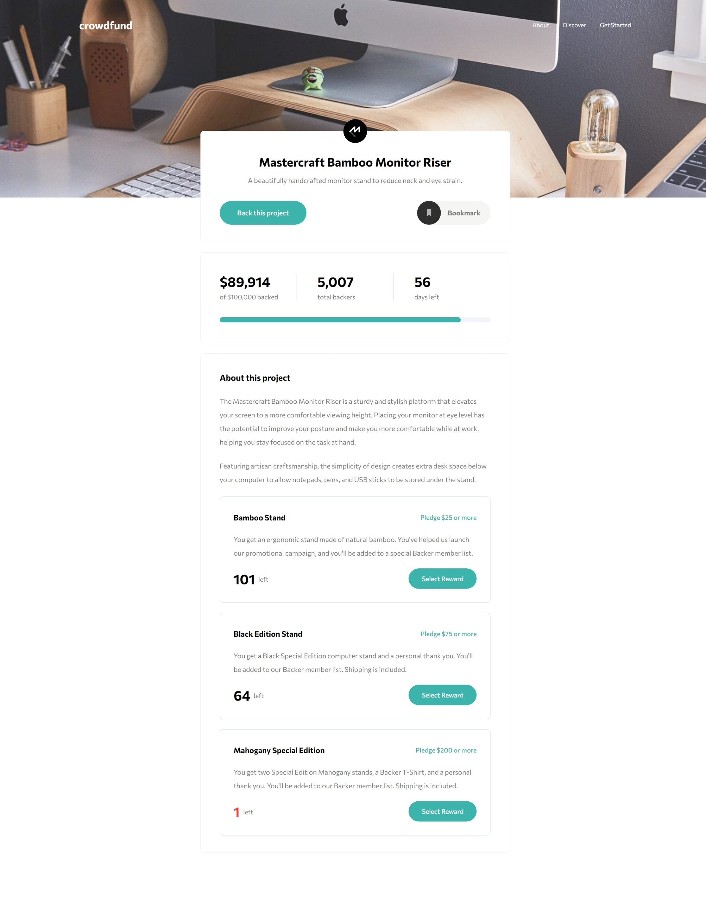
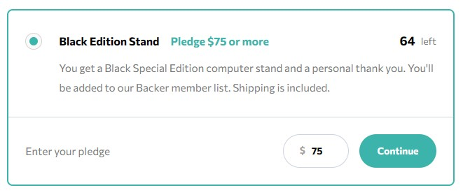
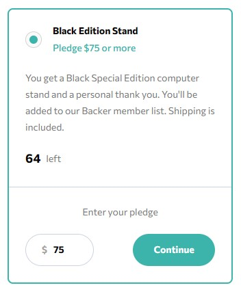
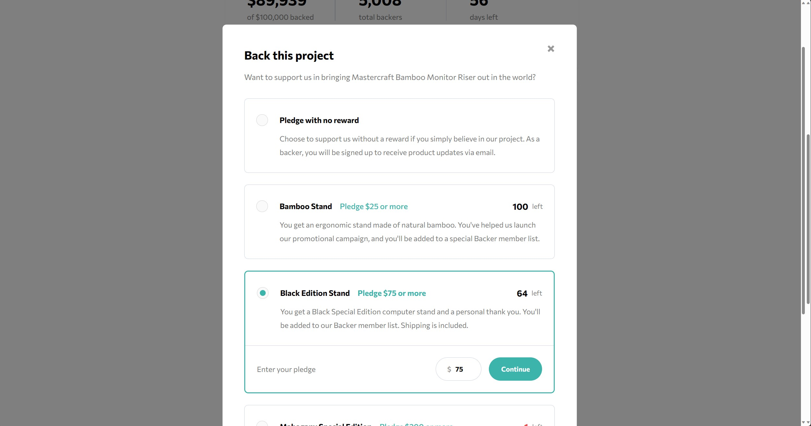

# Frontend Mentor - Crowdfunding Product Page

This is my solution to the [Crowdfunding Product Page Challenge](https://www.frontendmentor.io/challenges/crowdfunding-product-page-7uvcZe7ZR) on Frontend Mentor.

Let me first start off by saying that when I first started this challenge, I thought it was going to be pretty straightforward. I knew there were going to be some challenges along the way, but I didn't expect myself to encounter so many obstacles and learn so much even though it is just a Junior Dev challenge (which I will talk about later down below)!

And because of some of the hiccups that happened along the way, I severly underestimated the amount of time it would take me to complete this 😅

- Estimated: 2 weeks
- Actual: 1 month

## Table of contents

- [Overview](#overview)
  - [Challenge Description](#challenge-description)
  - [Screenshot](#screenshot)
  - [Links](#links)
- [My Process](#my-process)
  - [Built with](#built-with)
  - [What I learned](#what-i-learned)
    - [Responsive Navigation menu](#responsive-navigation-menu)
    - [Grid Row, Grid Column and Subgrid](#grid-row-grid-column-and-subgrid)
    - [Overlay Scrolling](#overlay-scrolling)
    - [Tailwind CSS](#tailwind-css)
  - [Continued development](#continued-development)
  - [Useful resources](#useful-resources)
- [Author](#author)
- [Acknowledgments](#acknowledgments)

## Overview

### Challenge Description

As the name of the challenge suggests, users should be able to:

- See what the product is about
- Bookmark the product if they are interested in it
- Make a selection of which pledge to make
- See hover states for interactive elements
- See the number of total backers increment by one after confirming a pledge
- See an updated progress bar and total money raised based on their pledge total after confirming a pledge
- View the optimal layout depending on their device's screen size

### Screenshot



### Links

- Challenge URL: [https://www.frontendmentor.io/challenges/crowdfunding-product-page-7uvcZe7ZR](https://www.frontendmentor.io/challenges/crowdfunding-product-page-7uvcZe7ZR)
- Solution URL: [https://github.com/ning-sy210/crowdfunding-product-page](https://github.com/ning-sy210/crowdfunding-product-page)
- Live Site URL: [https://ning-sy210.github.io/crowdfunding-product-page/](https://ning-sy210.github.io/crowdfunding-product-page/)

## My Process

### Built with

- [React](https://react.dev/) (TypeScript)
- [Tailwind CSS](https://tailwindcss.com/)
- Flexbox
- CSS Grid
- Mobile-first workflow

### What I learned

The biggest takeaway from this challenge has to be **the responsive design**, **Overlay Scrolling** and **Tailwind CSS**!

#### Responsive Navigation Menu

In some of the previous easier Frontend Mentor challenges that I have done, the responsiveness did not pose as huge of a problem as it did here, since all that was required to be done (in most cases) was to simply toggle the `flex-direction` between `row` and `column` for flexboxes, or to change the minimum dimensions for items in a responsive grid layout, as in `grid-template-columns: repeat(auto-fit, minmax(100px, 1fr))` for example, and maybe do some minor tweaks to the paddings, margins etc.

In this challenge, having to convert the navigation menu from a `position: absolute` container that stretches across the mobile screen to an inline flex container that is aligned with the brand turned out to be less straightforward than I thought. This was roughly what I had at first when I was building out the mobile view:

```tsx
const header = () => {
  const [showNav, setShowNav] = useState(false);

  return (
    <header>
      <h1 className="brand">crowdfund</h1>
      <div
        className="hamburger-icon"
        onClick={() => setShowNav((prev) => !prev)}
      ></div>
      {showNav && <nav className="navbar"></nav>} {/* details omitted for brevity */}
    </header>
  );
};
```

```css
header {
  position: relative;

  display: flex;
  justify-content: space-between;
  align-items: center;
}

.navbar {
  position: absolute;
  width: 100%;
}

@media screen and (min-width: 768px) {
  .hamburger-icon {
    display: none;
  }

  .navbar {
    position: static;
    width: auto;
  }
}
```

Which works in mobile view! But when switched to desktop view, things start to break because there exists no `.hamburger-icon` to toggle `setShowNav` to `true`, which means there won't ever appear a navigation bar!

To ensure the desktop view works, using `showNav` to directly control whether the navbar is rendered probably wasn't a good idea. The workaround I found was to use CSS to control whether the navbar is rendered instead. And so, this is what I ended up with:

```tsx
const header = () => {
  const [showNav, setShowNav] = useState(false);

  return (
    <header>
      <h1 className="brand">crowdfund</h1>
      <div
        className="hamburger-icon"
        onClick={() => setShowNav((prev) => !prev)}
      ></div>
      {/* changed here! */}
      <nav className={`${showNav ? "hidden" : ""} navbar`}></nav>
    </header>
  );
};
```

```css
// <--- newly added --->
// Specificity: (0, 1, 0)
.hidden {
  display: none;
}

header {
  position: relative;

  display: flex;
  justify-content: space-between;
  align-items: center;
}

.navbar {
  position: absolute;
  width: 100%;
}

@media screen and (min-width: 768px) {
  .hamburger-icon {
    display: none;
  }

  // Specificity: (0, 1, 0)
  .navbar {
    display: flex; // <--- newly added --->
    position: static;
    width: auto;
  }
}
```

With the above solution, when in mobile view, whether the navbar appears is controlled by the `.hidden` class. And in desktop view, the navbar will have a `display: flex` property and this will not be overridden regardless of `showNav` being `true` or `false`, as the `.navbar` (media-query) class is futher down the CSS file compared to the `.hidden` class and both classes have the same specificity.

#### Grid Row, Grid Column and Subgrid

The second responsive design obstacle that I encountered was that of the `<PledgeModalOption />` component where I had to position elements differently to achieve the varied look in mobile and desktop view.

&emsp;**Desktop View**

&emsp;

&emsp;**Mobile View**

&emsp;

To be honest, when I first noticed the difference between the mobile and desktop designs, I was stumped. I was so accustomed to elements being in order across different views that I couldn't think of a way to achieve the look on the spot.

Fortunately, I stumbled upon Kevin Powell's YouTube [video](https://www.youtube.com/watch?v=Zddz_R1RnfM&pp=ygUHc3ViZ3JpZA%3D%3D) on subgrids and it made me realize how powerful they are and their pertinence to this problem I was facing. And thus, the solution I ended up using for the desktop view is a combination of:

- `display: grid` on the parent element
- `grid-template-columns: subgrid` to achieve consistent spacing between sibling elements
- `grid-row` and `grid-column` on the child elements to position them in the parent grid

#### Overlay Scrolling



<br/>

Oh god, this was a major headache.

Even after completing this project, I still could not find a way to get rid of the double scrollbar. I could set `overflow: hidden` for the background element when the modal appears but doing so will cause the background to "jump" to the top when it should remain in place. When I weighed UI annoyance against a more jarring UX, I decided that having two scollbars is more acceptable.

#### Tailwind CSS

This is the first project in which I have used Tailwind. For all my past projects (work or personal), I have always used SASS mainly for the fact that it provides access to imperative-programming-like syntax for CSS (e.g. loops). SASS also provides the ability to nest CSS classes, of which was later introduced as part of Vanilla CSS in March 2023.

As someone who uses SASS predominantly, when I first discovered Tailwind, I immediately thought this was something I was never going to use. To me, Tailwind was just another form of inline styling which I thought was really ugly to write, read and maintain. But I didn't want to be one of those that denounce Tailwind without first trying it out, so I thought this project will be a good chance for me to assess whether Tailwind is able to live up to its hype.

And...

Let's just say I am still on the fence. As I would consider myself to be quite OCD, I still stand true to my belief that Tailwind is just not as pretty to read and write as compared to traditional ways of CSS. Having to read and write horizontally through lines of shortened CSS property and values is something that I still do not find joy in. What makes things worse is when I have to deal with writing media queries with multiple properties and values that need to be overridden, which was the case for this project.

But!

I definitely appreciate the ability to do away with writing class names because coming up with them can be a really huge pain in the rear sometimes. Also, the tailwind config file is really handy for declaring the project themes and styles in one central place, all while keeping things intuitive for the developer. So I really want to give props to Tailwind for that.

Overall, I would say I definitely think of Tailwind in a more positive light now. I can see its appeal and why it has the support of a large community of people. As for whether it will become my main CSS framework from here on out is a consideration for another day. At the moment I am still leaning away from Tailwind, but I don't think it is fair to base that verdict off the experience of using it in just one project alone.

### Continued development

Even though I had some experiences with these in this project, these are the concepts that I would like to work on more since I found myself to be still quite weak in them.

- CSS Grid and Subgrid
- `width: 100%` vs `width: auto`
- overlays (`position: fixed` and `position: absolute`)
- `::before` and `::after` pseudo-selectors

Things I would like to explore in my future projects:

- Jotai (React State Management)
- `:is` and `:has` pseudo classes

### Useful resources

- [Developer Mozilla](https://developer.mozilla.org/en-US/docs/Web/CSS) - CSS documentation
- [Tailwind CSS CheatSheet](https://tailwindcomponents.com/cheatsheet/) - Quick lookup to see the class name for the corresponding CSS property and value

## Acknowledgments

- Kevin Powell and his [YouTube Channel](https://www.youtube.com/@KevinPowell)
